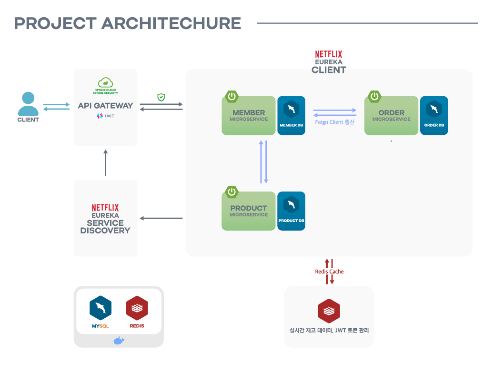
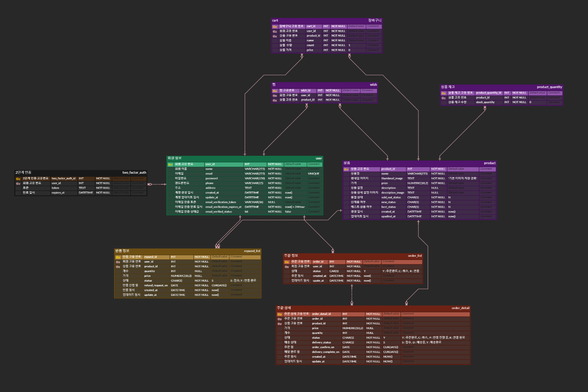

## Overview

---

**대규모의 트래픽을 처리해 선착순 구매 기능을 지원**하는 e-Commerce 기반의 웹 서비스입니다.

사용자는 이메일을 통한 회원가입을 포함한 정보 확인, 장바구니 기능, Wish 등록 기능을 경험할 수 있으며 **재고 수가 적은 인기 상품을 선착순으로 결제하고 구매할 수 있는 서비스**를 경험할 수 있습니다.


## 실행 명령어

``` bash
git clone https://github.com/KwakJaeHun/springboot-MSA.git

cd multi-module-project

./gradlew clean build

docker-compose up -d
```

## Project Architecture


## ERD


## Tech Stack

### Backend


### Database


### Etc


## Main Feature

---

- **MSA(MicroService Architecture)** 적용
  - 서비스의 확장성과 유지보수성 향상을 위한 MSA 도입
  - 유연성, 개발 속도 향상, 장애 격리를 기대해 볼 수 있음

  
- **Redis**의 원자성을 이용하여 **동시성 처리**를 통한 실시간 재고 데이터 관리
  - 결제 실패 시 재고를 복구하는 보상 트랜잭션 로직 구현
  - **write back cache** 전략 사용
  - 동시성 제어, 데이터 베이스 부하 감소, 데이터 일관성 유지
  

- **Spring Webflux Security, JWT AccessToken/RefreshToken**을 통한 요청 인증 / 인가
  - stateless 애플리케이션 설계


- **OpenFeign**를 활용한 마이크로서비스 간 통신
  - OpenFeign은 인터페이스 기반으로 REST 클라이언트를 선언적으로 정의
  - 코드가 간결하고 유지보수성 향상


- **Api Gateway**를 통한 라우팅 및 인가 기능 구현
  - 클라이언트 요청을 한 곳에서 처리하므로, 각 마이크로서비스가 직접 외부에 노출되지 않음
  - 시스템의 복잡성을 줄이고 관리 효율성 향상


- **Netflix Eureka**를 이용한 Client-side Discovery 방식의 Service Discovery 구현
  - 클라이언트가 사용 가능한 서비스를 알고 서비스별로 개별적인 로드 밸런싱 방법 선택 가능
  - 트래픽 분산 및 서비스 성능 최적화


- **스프링 스케줄러**를 통한 주문 및 배송 상태 관리
  - 주문 및 배송 상태의 주기적인 업데이트 프로세스 기획 및 구현


- **이메일 2차 인증**을 통한 회원가입
  - Google SMTP를 사용하여 회원가입 이메일 인증 링크 발송 구현
  - 보안 강화, 사용자 신뢰성 증가


- Docker, Docker Compose, Jenkins
  - 빌드 - 테스트 - 배포 파이프라인 구성
  - CI/CD 구성하여 개발 환경 구축과 동시에 배포


## 트러블 슈팅

---

### Trouble shooting

#### 동시성 제어
- 10,000건의 동시 주문 시 DB의 상품 수량 감소가 제대로 반영되지 않음. (10,000 → 7,856)

| 해결 과정                              | 문제점                                                                                        |
|------------------------------------|--------------------------------------------------------------------------------------------|
| @synchronized                      | synchronized는 한 트랜잭션에 대해서만 동시성을 보장 해주기 때문에 서버를 여러대로 두는 환경에서는 적합하지 않음                       |
| DB LOCK - 비관적 락 (Pessimistic Lock) | MSA 환경에서는 분산 DB를 사용하기 때문에 하나의 DB에서만 동시성 문제를 해결 할 수 있는 DB Lock 방식은 이 프로젝트의 해결방법에 적합하지 않음    |
| 분산락 (Redisson)                     | 분산락 방식이 MSA와 같은 분산 환경에서 동시성을 보장하기 위해 적합함. 하지만, 분산락 만으로 DB에 접근하게 되면, DB에서 I/O하는 것이 오버헤드가 큼. |

#### 최종 해결 방안
- 분산락 + Redis Cache (재고 데이터)
  - write back cache 전략은 감소 시킨 재고를 cache에만 업데이트 해주고 있다가, 한번에 DB에 업데이트 해주는 방식

[Trouble shooting 및 테스트 결과 정리](https://past-hound-16b.notion.site/c3982b6cb5db4b7489d759b9bde720ad#5b6e2892d0144798ae75e6a0b299b0ef)

## 마치며
해당 프로젝트를 혼자 진행하며 ERD 설계부터 MSA, 테스트 결과 도출 및 요약까지 짧은 기간 내에 해낸 것이 뿌듯했습니다. 
또한 최근 기술 트렌드 중 하나인 대용량 트래픽의 분산 처리에 대해 공부하고 어떤 기술을 적절히 사용할지에 대한 고민을 경험하였으며, 생각한 대로 구현하는 것이 재미있었습니다. 
새로운 기술을 배워가고 익히고 적절히 활용하는 방법에 대해 공부할 수 있었던 시간이었습니다.